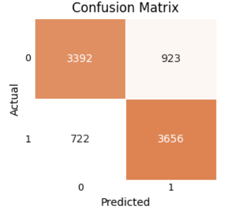
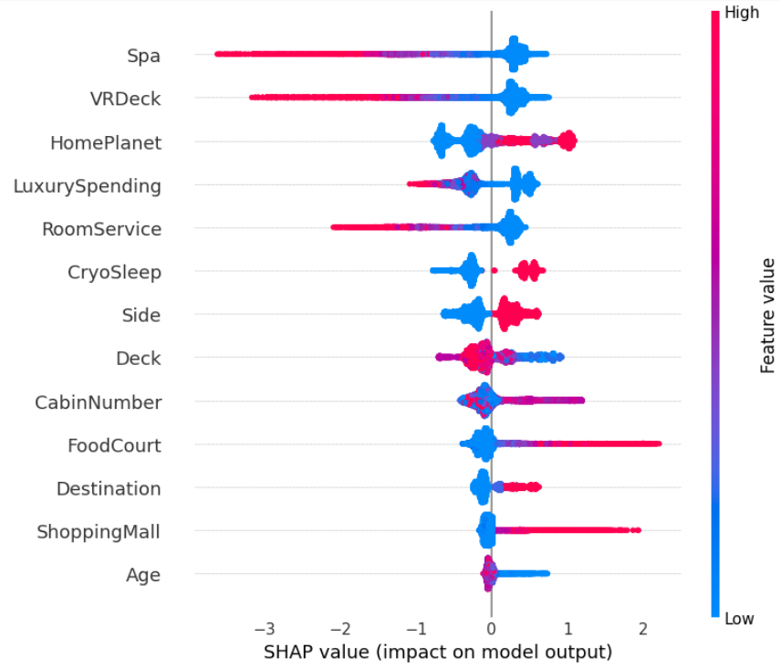

# Rescue Mission: Predicting Passenger Disappearances


## Dataset

The dataset for this project can be found on [Kaggle](https://www.kaggle.com/competitions/spaceship-titanic/overview/citation) (licensed under CC BY-SA 3.0).

The "Spaceship Titanic" dataset contains 8693 records of passengers from a fictional interstellar voyage, created for a Kaggle competition, with the goal of predicting whether or not a passenger was transported to another dimension following a collision with a spacetime anomaly. The dataset includes details such as passengers home planets, ages, whether they were in cryo sleep, cabin information, and their spending at various amenities. It also contains a target variable ("Transported"), indicating whether a passenger was teleported out of the ship.

Around 24% of the instances are corrupted (have some missing values). While some of this information can be filled by identifying commonalities between passengers, others require a more creative segmentation by filling in the most frequent values within a group.

## Objectives

The main objective of this project is:

> **Develop a binary classification model that can predict if a person was transported to another dimension.**

Since this is what will be evaluated on Kaggle and the labels are balanced, accuracy will be used as the primary metric for model evaluation.

To achieve this objective, the project was broken down into the following sub-objectives:

1. Perform exploratory data analysis and document insights.
2. Engineer new predictive features.
3. Select and develop a well-performing classification model.
4. Create and deploy a containerized API endpoint for the trained model.

## Insights Based on EDA

Descriptions of the relationships between target and predictors:

- The most predictive feature for transportation appears to be whether or not a person was in CryoSleep, with passengers in CryoSleep being much more likely to be transported.
- High luxury spenders (except for food court and shopping mall) are more likely to have avoided the transportation.
- Location on the ship does not appear to be a clear indicator of transportation.
- Having family or being part of a group improves the chance of survival very slightly.
- Other features show low predictive power.

### About the Incident:

- Event nature:
The event doesn't seem to be tied to specific locations on the ship but feels more global. The only clear factor is the ability to react, with CryoSleep passengers unable to do so.

- Impact on lower decks:
The upper decks were more affected, suggesting that technical staff may have been hit hardest. Most travelers would be located on the lower decks, where most residences are.

- Possible causes:
This could be due to several factors: the staff may have been in their quarters at the time of the event, they could have been trying to help passengers and got caught in the incident, or the CryoSleep pods, food court and shopping mall could have been positioned on the lower decks. 

- Additional information:
It would be helpful to have data showing whether a person was staff or a passenger, along with ship plans to understand the nature of the anomaly and estimates of passengers locations during the incident.

- Event timing:
The event seems to have lasted long enough for passengers to react instinctively, but not long enough for factors like family ties or wealth to significantly influence the outcomes.

## Engineered Features

Being part of a group or family may affect a passenger's chances of survival, as they would be more likely to receive help and assist them:

- GroupSize: The number of people traveling together in each group.
- IsInGroup: A binary feature indicating whether a passenger is part of a group.
- FamilySize: Family ties are likely stronger than group connections. FamilySize is based on the number of people with the same last name within a group.
- HasFamily: A binary indicator showing whether a passenger is traveling with family.

Wealth may also play a role in survival. Wealthy passengers may travel together, although some may not spend money, potentially hiding the effect of wealth:

- LuxurySpending: The total luxury spending for each passenger.
- Average spending for a group: Luxury spending for each spending type in a group.

Since the incident could be linked to specific areas of the ship, knowing where passengers were residing could be very important:

- Deck: The deck where the passenger's cabin was located.
- CabinNumber: The specific cabin number.
- Side: Indicates whether the cabin was on the port or starboard sde of the ship.

> **Of the features I engineered, only the features related to a person's residence on the ship (deck, side, and cabin number) and total luxury spending were useful for the model.**

## Model Selection

The algorithms tested were SVM, KNN, Logistic Regression, Random Forest, Gradient Boosting, XGBoost, CatBoost, and LightGBM. The best performing model is CatBoost with the following hyperparameters:

```json
{
    "depth": 7,
    "learning_rate": 0.023835569321578196,
    "l2_leaf_reg": 24.292507191462,
    "iterations": 1301,
    "subsample": 0.978360642238864,
    "colsample_bylevel": 0.5014425098048687,
    "bagging_temperature": 0.633573757114269
}

```

> **On the validation set, the model achieves an accuracy of around 0.811. However, on Kaggle's test set, the accuracy drops to 0.8.**

Confusion matrix for the validation set:

<div align="center">
    
</div>

### Model Explainability

<div align="center">
    
</div>
<br>
Tree-based models, like CatBoost, can use the same numeric feature multiple times for different splits, pushing these features higher up in importance. However, as we saw in the EDA, categorical features like "CryoSleep" and location on the ship (deck, cabin, side) are among the few indicators of transportation.

## Local Deployment

The FastAPI interface only accepts the features that were used during model training and demonstrated predictive power, rather than all the original features from the dataset.

### Step 1: Build Docker Image

Clone the repository, go to deployment folder and use docker command:

```shell
docker build -t fastapi-app .
```

### Step 2: Run the Container

```shell
docker run -p 8000:8000 fastapi-app
```

### Step 3: Access the App

```shell
http://localhost:8000/docs
```

You can send a POST request to the /predict/ endpoint with JSON data:

```jason
{
  "PassengerId": "0001_01",
  "Cabin": "B/0/P",
  "HomePlanet": "Europa",
  "CryoSleep": "True",
  "Destination": "TRAPPIST-1e",
  "Age": 39.0,
  "RoomService": 0.0,
  "FoodCourt": 0.0,
  "ShoppingMall": 0.0,
  "Spa": 0.0,
  "VRDeck": 0.0
}
```
